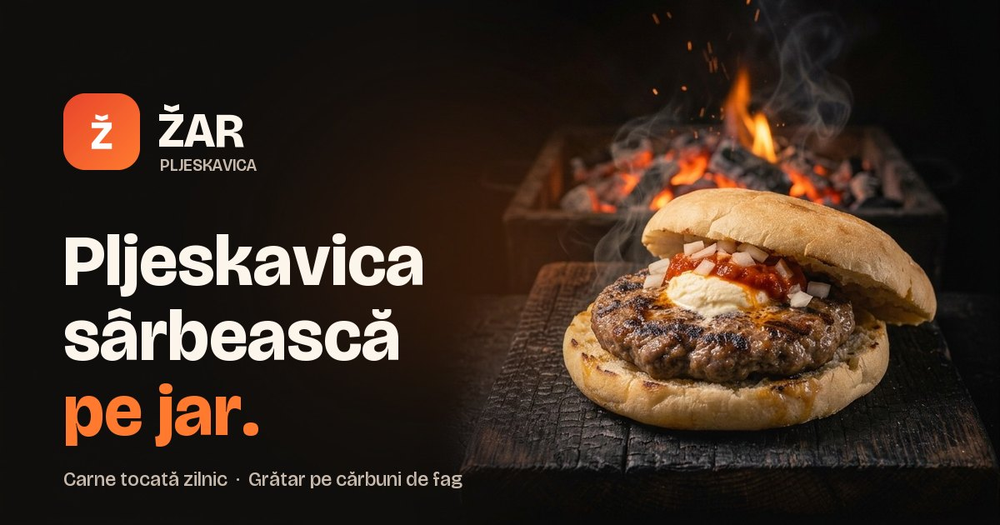

# ŽAR — Pljeskavica sârbească pe jar

Site de prezentare pentru **ŽAR**, local de pljeskavica sârbească: meniu, povestea casei, catering și locație.

**Live:** https://portalstudiodesign.github.io/zar-pljeskavica/



## Stare

🚧 **Previzualizare.** Datele de contact (telefon, adresă, program, email, firmă) nu sunt încă publicate. Până la lansare:

- pagina e marcată `noindex`, deci nu apare în Google;
- o bandă „Site în lucru” e afișată sus;
- formularul de catering validează câmpurile, dar nu trimite nimic.

Ce mai e de făcut până la lansare e în [issues](https://github.com/portalstudiodesign/zar-pljeskavica/issues). Checklist-ul pentru trecerea în varianta finală e în [#7](https://github.com/portalstudiodesign/zar-pljeskavica/issues/7).

## Structură

Site static, fără build și fără dependențe:

```
index.html     conținutul paginii
styles.css     stiluri (culori și dimensiuni în variabilele din :root)
script.js      meniu mobil, tab-uri meniu, animații, formular catering, scântei în hero
img/           poze .webp + imaginea de previzualizare pentru link-uri (og-image.jpg)
.nojekyll      GitHub Pages servește fișierele exact cum sunt
```

## Rulare locală

Orice server static merge, de exemplu:

```bash
python -m http.server 5178
```

Apoi deschide http://localhost:5178.

## Publicare

GitHub Pages servește ramura `main`, din rădăcină. Un `git push` pe `main` republică site-ul în ~1 minut.

## Poze

- Cardurile din meniu folosesc poze 4:3, cu preparatul în centru (decupate din originale 16:9).
- Poza din prima secțiune e pătrată, cu marginile aproape negre, pentru că se estompează în fundal.
- Numele fișierelor sunt referite din `index.html`. O poză nouă salvată cu același nume înlocuiește poza veche fără alte modificări.
- Originalele la rezoluție mare nu sunt în repo.

---

Design și dezvoltare: Portal Design Studio
